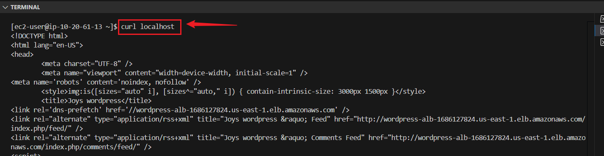
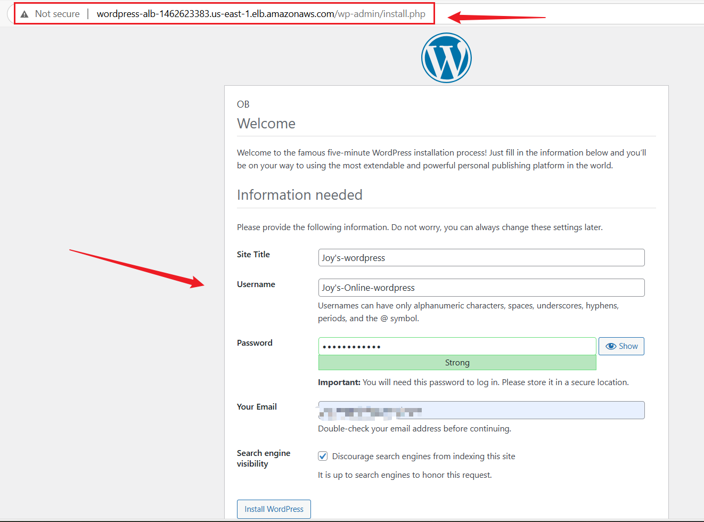
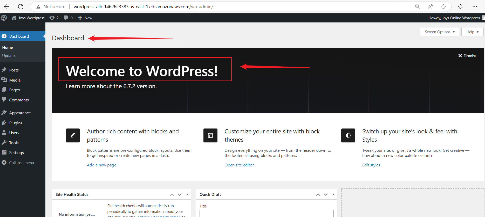

# 📘 Automated WordPress Deployment on AWS with Terraform

## Project Overview


---

##  Objective:
This project deploys a highly available, secure, and scalable WordPress application on AWS using Terraform Infrastructure as Code (IaC).

---

## Key Features
It uses a modular approach to provision:

+ A secure VPC with public/private subnets

+ A managed RDS MySQL database

+ EFS for shared file storage

+ Auto Scaling Group of EC2 instances

+ An Application Load Balancer (ALB)

+ Complete automation via Terraform & shell scripting

---

## 🔧 Prerequisites

Make sure you have:

+ AWS Account

+ IAM user with full EC2, VPC, RDS, and EFS access

+ AWS CLI configured

+ Terraform installed

+ A basic WordPress Docker image or EC2 AMI ready

---

## 🌐 Project Structure
```
wordpress-terraform-aws/
├── .gitignore
├── README.md
├── main.tf
├── variables.tf
├── terraform.tfvars
├── modules/
│   ├── vpc/
│   │   ├── main.tf
│   │   ├── variables.tf
│   │   └── outputs.tf
│   ├── nat_gateway/
│   │   ├── main.tf
│   │   ├── variables.tf
│   │   └── outputs.tf
│   ├── rds/
│   │   ├── main.tf
│   │   ├── variables.tf
│   │   └── outputs.tf
│   ├── efs/
│   │   ├── main.tf
│   │   ├── variables.tf
│   │   └── outputs.tf
│   ├── alb/
│   │   ├── main.tf
│   │   ├── variables.tf
│   │   └── outputs.tf
│   ├── asg/
│   │   ├── main.tf
│   │   ├── variables.tf
│   │   ├── outputs.tf
│   │   └── user_data.sh
│   ├── bastion/
│   │   ├── main.tf
│   │   ├── variables.tf
│   │   └── outputs.tf
│   └── wordpress/
│       ├── main.tf
│       ├── variables.tf
│       └── outputs.tf
```
---

## Create .gitignore to Exclude Sensitive Files
```
touch .gitignore
```
**Paste**
```
# Terraform state files
*.tfstate
*.tfstate.*
crash.log

# Terraform variable files (secrets!)
terraform.tfvars
*.tfvars

# .terraform directory
.terraform/

# Override files you don’t want in repo
override.tf
override.tf.json

# Sensitive shell scripts or config
*.pem
*.key
*.crt
*.env
user_data.sh

# OS/system-specific files
.DS_Store
Thumbs.db

# Log files
*.log

# Backup files
*.bak
*.tmp
*.swp
*.swo
```
---

## 🚀 Getting Started
+ Create a Repository on Github and clone into it:
```
git clone https://github.com/yourusername/wordpress-terraform-aws.git
cd wordpress-terraform-aws/
```


---


## Create root-level files
```
touch main.tf variables.tf terraform.tfvars outputs.tf
```

## Create root main.tf
**Note:** I added each module at to the main.tf(root) as I progressed.

**File: main.tf (root)**
```
provider "aws" {
  region = "us-east-1"
}

module "vpc" {
  source   = "./modules/vpc"
  vpc_cidr = var.vpc_cidr
}

module "bastion" {
  source                 = "./modules/bastion"
  ec2_key_name           = var.ec2_key_name
  bastion_instance_type  = var.bastion_instance_type
  ami_id                 = var.bastion_ami
  vpc_id                 = module.vpc.vpc_id
  public_subnet_ids      = module.vpc.public_subnet_ids
}

module "wordpress" {
  source                  = "./modules/wordpress"
  vpc_id                  = module.vpc.vpc_id
  private_subnet_ids      = module.vpc.private_subnet_ids
  ami_id                  = var.wordpress_ami
  ec2_key_name            = var.ec2_key_name
  wordpress_instance_type = var.wordpress_instance_type
  bastion_sg_id           = module.bastion.bastion_sg_id   
}

module "rds" {
  source              = "./modules/rds"
  vpc_id              = module.vpc.vpc_id
  private_subnet_ids  = module.vpc.private_subnet_ids
  ec2_sg_id           = module.wordpress.wordpress_sg_id
  db_name             = var.db_name
  db_user             = var.db_user
  db_pass             = var.db_pass
}

module "efs" {
  source             = "./modules/efs"
  vpc_id             = module.vpc.vpc_id
  private_subnet_ids = module.vpc.private_subnet_ids
  ec2_sg_id          = module.wordpress.wordpress_sg_id
}

module "alb" {
  source             = "./modules/alb"
  vpc_id             = module.vpc.vpc_id
  public_subnet_ids  = module.vpc.public_subnet_ids
}

module "asg" {
  source             = "./modules/asg"
  ami_id             = var.wordpress_ami
  instance_type      = var.wordpress_instance_type
  key_pair_name      = var.ec2_key_name
  security_group_ids = [module.wordpress.wordpress_sg_id]
  private_subnet_ids = module.vpc.private_subnet_ids
  target_group_arn   = module.alb.alb_target_group_arn
  efs_dns_name       = module.efs.efs_dns_name
}
```

## Create Root variables.tf
**File: variables.tf (root)**
```
variable "vpc_cidr" {
  description = "CIDR block for the VPC"
  type        = string
}

variable "db_name" {
  description = "Database name for RDS"
  type        = string
}

variable "db_user" {
  description = "Database master username"
  type        = string
}

variable "db_pass" {
  description = "Database master password"
  type        = string
  sensitive   = true
}

variable "ec2_key_name" {
  description = "The key name to use for the EC2 instance"
  type        = string
}

variable "ami_id" {
  description = "The AMI ID for the ec2"
  type        = string
}

variable "vpc_id" {
  description = "ID of the VPC"
  type        = string
}

variable "public_subnet_ids" {
  description = "List of public subnet IDs"
  type        = list(string)
}

variable "wordpress_instance_type" {
  description = "Instance type for WordPress application"
  type        = string
  default     = "t3.micro"
}

variable "bastion_instance_type" {
  description = "Instance type for Bastion host"
  type        = string
  default     = "t2.micro"
}
```

**File: outputs.tf (Root)**
```
output "vpc_id" {
  description = "The ID of the VPC"
  value       = module.vpc.vpc_id
}

output "public_subnets" {
  description = "The public subnet IDs"
  value       = module.vpc.public_subnet_ids
}

output "private_subnets" {
  description = "The private subnet IDs"
  value       = module.vpc.private_subnet_ids
}

output "wordpress_sg_id" {
  value = module.wordpress.wordpress_sg_id
}

output "alb_dns_name" {
  value = module.alb.alb_dns_name
}

output "alb_target_group_arn" {
  value = module.alb.alb_target_group_arn
}
```

## Create terraform.tfvars
**File: terraform.tfvars**
```
vpc_cidr          = "10.20.0.0/16"
db_name           = "wordpress_db"
db_user           = "admin"
db_pass           = "supersecurepassword123"
vpc_id            = "vpc-02d93e93407d3a249"
public_subnet_ids = ["subnet-05b9c815aa964cb53", "subnet-00f8bb5b4532d0025"]
ami_id            = "ami-00a929b66ed6e0de6"
ec2_key_name      = "wordpress-key"   
```
---


## 🌐1️⃣: Create the VPC module files
Inside the modules/vpc folder, run:
```
mkdir -p modules/vpc
touch main.tf variables.tf outputs.tf
```

## 🔹 VPC, Subnets & NAT Gateway
**Files:**

+ **main.tf:** VPC, public/private subnets, IGW, NAT, route tables

+ **variables.tf:** CIDRs, region, subnet counts

+ **outputs.tf:** Subnet IDs, VPC ID

### 🔐 Security Measures:

+ Public subnet: only ALB allowed

+ Private subnet: internet via NAT only


 ## main.modules/vpc/
 **main.tf**
 ```
 resource "aws_vpc" "main" {
  cidr_block = var.vpc_cidr
  enable_dns_support = true
  enable_dns_hostnames = true
  tags = {
    Name = "wordpress-vpc"
  }
}

resource "aws_internet_gateway" "igw" {
  vpc_id = aws_vpc.main.id
}

resource "aws_subnet" "public" {
  count             = 2
  cidr_block        = cidrsubnet(var.vpc_cidr, 4, count.index)
  vpc_id            = aws_vpc.main.id
  availability_zone = data.aws_availability_zones.available.names[count.index]
  map_public_ip_on_launch = true
}

resource "aws_subnet" "private" {
  count             = 2
  cidr_block        = cidrsubnet(var.vpc_cidr, 4, count.index + 2)
  vpc_id            = aws_vpc.main.id
  availability_zone = data.aws_availability_zones.available.names[count.index]
}

resource "aws_nat_gateway" "nat" {
  allocation_id = aws_eip.nat.id
  subnet_id     = aws_subnet.public[0].id
}

resource "aws_eip" "nat" {
  domain = "vpc"
  # other arguments...
}

resource "aws_route_table" "public_rt" {
  vpc_id = aws_vpc.main.id
  route {
    cidr_block = "0.0.0.0/0"
    gateway_id = aws_internet_gateway.igw.id
  }
}

resource "aws_route_table_association" "public_assoc" {
  count = length(aws_subnet.public)
  subnet_id      = aws_subnet.public[count.index].id
  route_table_id = aws_route_table.public_rt.id
}

resource "aws_route_table" "private_rt" {
  vpc_id = aws_vpc.main.id
  route {
    cidr_block     = "0.0.0.0/0"
    nat_gateway_id = aws_nat_gateway.nat.id
  }
}

resource "aws_route_table_association" "private_assoc" {
  count = length(aws_subnet.private)
  subnet_id      = aws_subnet.private[count.index].id
  route_table_id = aws_route_table.private_rt.id
}

data "aws_availability_zones" "available" {}
```

**main.modules/vpc/**
**variable.tf**
```
variable "vpc_cidr" {
  type    = string
  default = "10.20.0.0/16"
}
```

 **main.modules/vpc/**
 **output.tf**
 ```
output "vpc_id" {
  value = aws_vpc.main.id
}

output "public_subnet_ids" {
  value = aws_subnet.public[*].id
}

output "private_subnet_ids" {
  value = aws_subnet.private[*].id
}
```

## Configure aws, Initilize and Apply terraform:
```
aws configure
terraform init
terraform validate
terraform plan
terraform apply
```
---


## Shell Commands to Create This Structure
Run these commands:
```
# Create top-level files
touch .gitignore README.md main.tf variables.tf terraform.tfvars

# Create modules and their subfolders
mkdir -p modules/nat_gateway modules/rds modules/efs modules/alb modules/asg


touch modules/rds/main.tf modules/rds/variables.tf modules/rds/outputs.tf

touch modules/efs/main.tf modules/efs/variables.tf modules/efs/outputs.tf

touch modules/alb/main.tf modules/alb/variables.tf modules/alb/outputs.tf

touch modules/asg/main.tf modules/asg/variables.tf modules/asg/outputs.tf modules/asg/user_data.sh
```

## 🗃️ 2️⃣: RDS (MySQL Database)
**Module: modules/rds/**

**Files:**

+ **main.tf:** RDS instance, parameter group

+ **variables.tf:** DB name, username, password

+ **outputs.tf:** RDS endpoint

## 🔐 Security Measures:

+ DB not publicly accessible

+ Only EC2 subnet security group can connect (port 3306)

## modules/rds/ — MySQL Database with Terraform
**main.tf**
```
resource "aws_db_subnet_group" "rds_subnet_group" {
  name       = "rds-subnet-group"
  subnet_ids = var.private_subnet_ids

  tags = {
    Name = "rds-subnet-group"
  }
}

resource "aws_security_group" "rds_sg" {
  name        = "rds-sg"
  description = "Allow MySQL access from EC2"
  vpc_id      = var.vpc_id

  ingress {
    from_port   = 3306
    to_port     = 3306
    protocol    = "tcp"
    cidr_blocks = var.ec2_sg_id != null ? [] : ["0.0.0.0/0"]  # fallback if no sg
    security_groups = var.ec2_sg_id != null ? [var.ec2_sg_id] : []
  }

  egress {
    from_port   = 0
    to_port     = 0
    protocol    = "-1"
    cidr_blocks = ["0.0.0.0/0"]
  }
}

resource "aws_db_instance" "wordpress_db" {
  allocated_storage    = 20
  engine               = "mysql"
  engine_version       = "8.0"
  instance_class       = "db.t3.micro"
  db_name                = var.db_name
  username             = var.db_user
  password             = var.db_pass
  db_subnet_group_name = aws_db_subnet_group.rds_subnet_group.name
  vpc_security_group_ids = [aws_security_group.rds_sg.id]
  skip_final_snapshot  = true
  publicly_accessible  = false

  tags = {
    Name = "wordpress-mysql"
  }
}
```

**variables.tf**
```
variable "vpc_id" {
  type = string
}

variable "private_subnet_ids" {
  type = list(string)
}

variable "ec2_sg_id" {
  description = "Security group ID for EC2 to allow MySQL access"
  type = string
  default     = null
}

variable "db_name" {
  type = string
}

variable "db_user" {
  type = string
}

variable "db_pass" {
  type = string
  sensitive = true
}
```

**outputs.tf**
```
output "rds_endpoint" {
  value = aws_db_instance.wordpress_db.endpoint
}
```

### Terraform Commands:
```
terraform init
terraform plan
terraform apply
terraform state list
```

## 3️⃣: Bastion Host and WordPress EC2 Configuration
**Create the directories**
```
mkdir -p modules/bastion/main.tf 
touch modules/bastion/main.tf modules/bastion/variable.tf modules/bastion/output.tf
mkdir -p modules/wordpress
touch modules/wordpress/main.tf modules/wordpress/variable.tf modules/wordpress/output.tf
```

### Bastion Host Configuration
**Create modules/bastion/**

**main.tf**

```
resource "aws_security_group" "bastion_sg" {
  name        = "bastion-sg"
  description = "Allow SSH access to Bastion host"
  vpc_id      = var.vpc_id

  ingress {
    from_port   = 22
    to_port     = 22
    protocol    = "tcp"
    cidr_blocks = ["0.0.0.0/0"]
  }

  egress {
    from_port   = 0
    to_port     = 0
    protocol    = "-1"
    cidr_blocks = ["0.0.0.0/0"]
  }
}

resource "aws_instance" "bastion" {
  ami                    = var.ami_id
  instance_type          = var.bastion_instance_type
  key_name               = var.ec2_key_name
  subnet_id              = element(var.public_subnet_ids, 0)
  vpc_security_group_ids = [aws_security_group.bastion_sg.id]

  tags = {
    Name = "bastion-host"
  }
}
```

**variable.tf**
```
variable "vpc_id" {
  description = "The ID of the VPC where resources are deployed."
}

variable "public_subnet_ids" {
  description = "List of public subnet IDs."
  type        = list(string)
}

variable "ami_id" {
  description = "AMI ID to use for the EC2 instance."
}

variable "ec2_key_name" {
  description = "The EC2 key pair name to use for SSH access."
}

variable "bastion_instance_type" {
  description = "EC2 instance type for the Bastion host"
  type        = string
}
```

**output.tf**
```
output "bastion_sg_id" {
  value = aws_security_group.bastion_sg.id
}
```


### WordPress EC2 Configuration

**Create modules/WordPress/**

**main.tf**
```
resource "aws_instance" "wordpress" {
  ami           = var.ami_id
  instance_type = var.wordpress_instance_type
  key_name      = var.ec2_key_name
  subnet_id     = var.private_subnet_ids[0]
  security_groups = [var.bastion_sg_id]
}
  
resource "aws_security_group" "wordpress_sg" {
  name        = "wordpress-sg"
  description = "Allow HTTP access to WordPress"
  vpc_id      = var.vpc_id

  ingress {
    from_port   = 80
    to_port     = 80
    protocol    = "tcp"
    cidr_blocks = ["0.0.0.0/0"]
  }

  ingress {
    from_port      = 22
    to_port        = 22
    protocol       = "tcp"
    security_groups = [var.bastion_sg_id]
  }

  egress {
    from_port   = 0
    to_port     = 0
    protocol    = "-1"
    cidr_blocks = ["0.0.0.0/0"]
  }
}
```

**variable.tf**
```
variable "vpc_id" {
  description = "The ID of the VPC where resources are deployed."
}

variable "private_subnet_ids" {
  description = "List of private subnet IDs."
  type        = list(string)
}

variable "ami_id" {
  description = "AMI ID to use for the EC2 instance."
}

variable "ec2_key_name" {
  description = "The EC2 key pair name to use for SSH access."
}

variable "wordpress_instance_type" {
  description = "Instance type for WordPress EC2 instance."
  default     = "t3.micro"
}

variable "bastion_sg_id" {
  description = "Security group ID of the Bastion host"
  type        = string
}
```

**output**
```
output "wordpress_sg_id" {
  value = aws_security_group.wordpress_sg.id
}
```

**Commands:**
```
terraform init
terraform validate
terraform plan
terraform apply
terraform state list
```


## 📁 4️⃣: EFS (Shared WordPress Files)
Module: modules/efs/

**Files:**

+ **main.tf:** EFS filesystem and mount targets

+ **variables.tf:** subnet IDs

+ **outputs.tf:** EFS ID, DNS name

### 🔐 Security Measures:

+ EFS is private and encrypted.

+ Only EC2 instances (via their SG) can mount the file system via port 2049 (NFS).


## modules/efs/ — Shared File System for WordPress

**main.tf**
```
resource "aws_efs_file_system" "wordpress_efs" {
  creation_token = "wordpress-efs"
  encrypted      = true

  tags = {
    Name = "wordpress-efs"
  }
}

resource "aws_security_group" "efs_sg" {
  name        = "efs-sg"
  description = "Allow NFS from EC2 instances"
  vpc_id      = var.vpc_id

  ingress {
    from_port       = 2049
    to_port         = 2049
    protocol        = "tcp"
    security_groups = [var.ec2_sg_id]
  }

  egress {
    from_port   = 0
    to_port     = 0
    protocol    = "-1"
    cidr_blocks = ["0.0.0.0/0"]
  }
}

resource "aws_efs_mount_target" "efs_mount" {
  count          = length(var.private_subnet_ids)
  file_system_id = aws_efs_file_system.wordpress_efs.id
  subnet_id      = var.private_subnet_ids[count.index]
  security_groups = [aws_security_group.efs_sg.id]
}
```

**variables.tf**
```
variable "private_subnet_ids" {
  description = "The list of private subnet IDs."
  type        = list(string)
}

variable "vpc_id" {
  description = "The VPC ID where resources will be created."
  type        = string
}

variable "ec2_sg_id" {
  description = "The EC2 security group ID."
  type        = string
}
```


**outputs.tf**
```
output "efs_id" {
  value = aws_efs_file_system.wordpress_efs.id
}

output "efs_dns_name" {
  value = aws_efs_file_system.wordpress_efs.dns_name
}
```

**Commands:**
```
terraform init
terraform validate
terraform plan
terraform apply
```

## ⚖️ 5️⃣: Application Load Balancer (ALB)

**Module: modules/alb/**

**Files:**

+ **main.tf:** ALB, target group, listener

+ **variables.tf:** ALB name, VPC ID

+ **outputs.tf:** ALB DNS name

### 🔐 Security Measures:

+ Accepts HTTP (port 80) only

+ Sends traffic to EC2 in private subnet


## Module: modules/alb/

**main.tf**
```
resource "aws_lb" "wordpress_alb" {
  name               = "wordpress-alb"
  internal           = false
  load_balancer_type = "application"
  security_groups    = [aws_security_group.alb_sg.id]
  subnets            = var.public_subnet_ids

  tags = {
    Name = "wordpress-alb"
  }
}

resource "aws_security_group" "alb_sg" {
  name        = "alb-sg"
  description = "Allow HTTP traffic to ALB"
  vpc_id      = var.vpc_id

  ingress {
    from_port   = 80
    to_port     = 80
    protocol    = "tcp"
    cidr_blocks = ["0.0.0.0/0"]
  }

  egress {
    from_port   = 0
    to_port     = 0
    protocol    = "-1"
    cidr_blocks = ["0.0.0.0/0"]
  }
}

resource "aws_lb_target_group" "wordpress_tg" {
  name     = "wordpress-tg"
  port     = 80
  protocol = "HTTP"
  vpc_id   = var.vpc_id
  target_type = "instance"

  health_check {
    path                = "/"
    interval            = 30
    timeout             = 5
    healthy_threshold   = 2
    unhealthy_threshold = 2
    matcher             = "200-399"
  }

  tags = {
    Name = "wordpress-target-group"
  }
}

resource "aws_lb_listener" "http" {
  load_balancer_arn = aws_lb.wordpress_alb.arn
  port              = 80
  protocol          = "HTTP"

  default_action {
    type             = "forward"
    target_group_arn = aws_lb_target_group.wordpress_tg.arn
  }
}
```

**variable.tf**
```
variable "vpc_id" {
  type = string
}

variable "public_subnet_ids" {
  type = list(string)
}
```

**output.tf**
```
output "alb_dns_name" {
  value = aws_lb.wordpress_alb.dns_name
}

output "alb_arn" {
  description = "The ARN of the ALB"
  value       = aws_lb.wordpress_alb.arn
}

output "alb_sg_id" {
  value = aws_security_group.alb_sg.id
}

output "alb_target_group_arn" {
  value = aws_lb_target_group.wordpress_tg.arn
}
```

**Commands:**
```
terraform init
terraform validate
terraform plan
terraform apply
terraform state list
```


---

## 📈 5️⃣: Auto Scaling Group (ASG) and EC2 Instances

**Modules:**

**modules/asg/**

**modules/ec2/**

**Files:**

**main.tf:** Launch template with user_data to install WordPress

+ Includes mount EFS, connect to RDS

+ Sets up Auto Scaling policy (CPU-based)

### 🔐 Security Measures:

+ EC2 instances use private subnets and only communicate through ALB.

+ Automatically scales instances with health check support.

+ Launch Template uses user_data.sh to install WordPress + mount EFS.


##  modules/asg/ — Auto Scaling Group for WordPress

## 🌍 user_data.sh 
```
#!/bin/bash

#mount wordpress acces point
mkdir /var/www/
sudo mount -t efs -o tls,accesspoint=fsap-075d969a83a54d104 fs-0c3e3beaeaec45aae:/ /var/www/

#Install httpd
yum install -y httpd 
systemctl start httpd
systemctl enable httpd

#install dependencies
yum module reset php -y
yum module enable php:remi-7.4 -y
yum install php php-common php-mbstring php-opcache php-intl php-xml php-gd php-curl php-mysqlnd php-fpm php-json -y
systemctl start php-fpm
systemctl enable php-fpm

#download wordpress
wget http://wordpress.org/latest.tar.gz

#setup wordpress
tar xzvf latest.tar.gz
rm -rf latest.tar.gz
cp wordpress/wp-config-sample.php wordpress/wp-config.php
mkdir /var/www/html/
cp -R /wordpress/* /var/www/html/

#create healthstatus file
cd /var/www/html/
touch healthstatus

#changing the localhost to RDS endpoint
sed -i "s/localhost/terraform-20250415151647635200000002.c7oiy86sk0e7.us-east-1.rds.amazonaws.com/g" wp-config.php

#set up the username and password for the RDS 
sed -i "s/username_here/admin/g" wp-config.php 
sed -i "s/password_here/supersecurepassword123/g" wp-config.php 
sed -i "s/database_name_here/wordpress_db/g" wp-config.php 
chcon -t httpd_sys_rw_content_t /var/www/html/ -R
systemctl restart httpd
```


## modules/asg/

**main.tf**
```
resource "aws_launch_template" "wordpress_lt" {
  name_prefix   = "wordpress-launch-"
  image_id      = var.ami_id
  instance_type = var.instance_type
  key_name      = var.key_pair_name

  vpc_security_group_ids = var.security_group_ids

  user_data = base64encode(file("${path.module}/user_data.sh"))

  block_device_mappings {
    device_name = "/dev/xvda"
    ebs {
      volume_size = 10
      volume_type = "gp2"
      delete_on_termination = true
    }
  }

  lifecycle {
    create_before_destroy = true
  }

  tags = {
    Name = "wordpress-instance"
  }
}

resource "aws_autoscaling_group" "wordpress_asg" {
  name                      = "wordpress-asg"
  max_size                  = var.max_size
  min_size                  = var.min_size
  desired_capacity          = var.desired_capacity
  vpc_zone_identifier       = var.private_subnet_ids
  health_check_type         = "EC2"
  health_check_grace_period = 300

  launch_template {
    id      = aws_launch_template.wordpress_lt.id
    version = "$Latest"
  }

  target_group_arns = [var.target_group_arn]

  tag {
    key                 = "Name"
    value               = "wordpress-instance"
    propagate_at_launch = true
  }

  lifecycle {
    create_before_destroy = true
  }
}
```

**variables.tf**
```
variable "ami_id" {
  description = "AMI ID for EC2"
  type        = string
}

variable "instance_type" {
  default     = "t3.micro"
  description = "EC2 instance type"
}

variable "key_pair_name" {
  type = string
}

variable "security_group_ids" {
  type = list(string)
}

variable "private_subnet_ids" {
  type = list(string)
}

variable "target_group_arn" {
  type = string
}

variable "min_size" {
  default = 1
}

variable "max_size" {
  default = 3
}

variable "desired_capacity" {
  default = 1
}

variable "efs_dns_name" {
  description = "DNS name of the EFS file system"
  type        = string
}
```

**outputs.tf**
```
output "asg_name" {
  value = aws_autoscaling_group.wordpress_asg.name
}
```

**Command**
```
terraform init
terraform validate
terraform plan
terraform apply -target=module.asg
terraform state list
terraform output alb_dns_name
```


---


## 🎥 Live Demonstration of Wordpress Site 

### SSH into your Private EC2 instance (via Bastion Host)

```
# SSH into public Bastion:
ssh -i path/to/your-key.pem ec2-user@<your-bastion-public-ip>

# Copy keypair into Bastion (from local terminal):
scp -i "keypair.pem" wordpress-key.pem ec2-user@<your-bastion-public-ip>:/home/ec2-user/

# On Bastion:
chmod 400 wordpress-key.pem
ssh -i wordpress-key.pem ec2-user@<your-private-ec2-ip>

# Restart apache and check WordPress is working:
sudo systemctl restart httpd
curl localhost
```

### Check if WordPress Exists on EC2 
```
ls /var/www/html/
cat /var/www/html/wp-config.php
sudo systemctl restart httpd
curl localhost
```




### Verify WordPress Deployment via Terminal
```
terraform output alb_dns
curl http://your-alb-dns-name
```


## 🌐 Test the Live WordPress Site
Open the site via the Load Balancer's DNS Output:
```
terraform output alb_dns_name
```


### Test the Live WordPress Site

visit the ALB DNS in a browser:
```
http://your-alb-dns-name
```




---

### Confirm Target Health in Target Group
After deployment, ensure the EC2 instance is healthy in the ALB's target group. A healthy target confirms that the load balancer can route traffic correctly to your WordPress server.


## 🧪 Simulate Auto Scaling (Live Demo)
From your terminal (or EC2 instance), run:
```
ab -n 1000 -c 50 http://<ALB-DNS>/
```


## 🔁 Monitor Scaling in CloudWatch
```
ab -n 10000 -c 100 http://wordpress-alb-1462623383.us-east-1.elb.amazonaws.com/
aws autoscaling describe-auto-scaling-groups
```


## 🧼 Clean up Resources
```
terreform destroy
```


## ✅ Best Practices Implemented

✔️ Multi-AZ deployment for high availabilty

✔️ EFS used for WordPress file storage (data persistence)

✔️ RDS MySQL for WordPress backend database

✔️ User Data + Cloud-init for EC2 configuration

✔️ Modular Terraform structure for reusability

✔️ Load Balancer integrated with Auto Scaling Group

✔️ Bastion host setup for secure EC2 access


## 🔚 Conclusion
This project showcases the power of infrastructure as code (IaC) with Terraform to provision and manage a full-stack WordPress environment on AWS. By integrating best practices like modularity, high availability, auto-scaling, and security (via Bastion and VPC setup), you achieve a production-grade deployment that can handle real-world workloads with ease.

## Push to Github
```
git add .gitignore
git add .
git commit -m "Initial commit with .gitignore"
git push -u origin main
git status
```


## 👨‍💻 Author

**Name:** Joy Nwatuzor

**Capstone Project** | DevOps Engineer Track

**Happy building! 🎉**

**Terraform | AWS | WordPress | Automation**